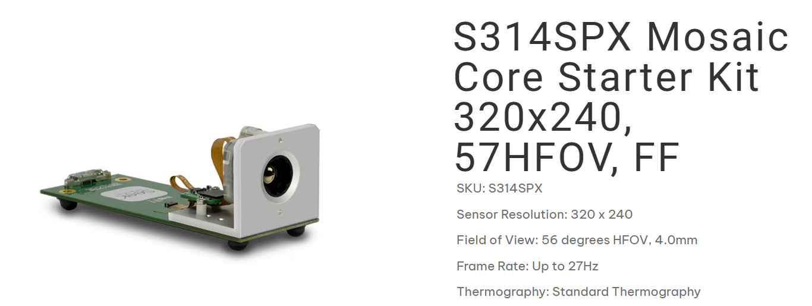

# Thermal Distance Sensor

A triangulation system for measuring distance and angles to thermally reflective glass surfaces using thermal imaging and heat emitters.


## Overview

This project implements a non-contact distance and angle measurement system using a thermal camera and multiple heat emitters positioned at known offsets. The system detects glass surfaces by leveraging the unique thermal properties of glass - it's opaque to longwave IR, causing heat signatures to reflect rather than pass through.


https://github.com/user-attachments/assets/a59d74d8-4792-49ac-be6e-955b5a7c6dcb

### Key Features

- **Real-time distance measurement** to reflective surfaces (glass)
- **Camera orientation tracking** (yaw and pitch angles)
- **Sub-pixel accuracy** using Gaussian-weighted centroid detection
- **Adaptive filtering** with bias correction for stable readings
- **Visual UI** with thermal image display and measurement overlay

## How It Works

### Physical Principle

Glass is opaque to longwave infrared (LWIR) radiation, which means thermal cameras see glass as a mirror. When heat emitters are positioned near the camera, their reflections appear as hot spots in the thermal image.

Current implementation uses two heat emitters - one above and one on the left.

```
                    GLASS SURFACE
                         │
    [ABOVE EMITTER]      │      reflection of ABOVE
           │             │            │
           │ 2.5cm       │            │
           │             │            │
    [CAMERA]─────────────┼────────────●  ← visible hot spot
           │             │            │
           │             │            │
    [LEFT EMITTER]───────┼────────────●  ← visible hot spot
         3.3cm           │
                         │
```

### Distance Calculation

The pixel separation between the two reflected hot spots is inversely proportional to distance:

```
distance = K / (pixel_separation × 2)
```

Where:
- `K` = calibration constant (1335 pixels×cm for this setup)
- `pixel_separation` = Euclidean distance between spots in pixels

### Angle Calculation

Camera orientation is determined by the position of hot spots relative to the image center:

```
yaw = -(spot_x - center_x) / 160 × 28°    # Horizontal angle
pitch = (spot_y - center_y) / 120 × 22°   # Vertical angle
```

## Hardware Requirements

| Component | Specification |
|-----------|--------------|
| Thermal Camera | Seek Thermal SD314SPX Drone Core |
| Resolution | 320 × 240 pixels |
| Field of View | 56° horizontal, ~44° vertical |
| Heat Emitters | 2× positioned at known offsets |
| Emitter Position | 2.5cm above, 3.3cm left of camera |

## Software Dependencies

- **Seek Thermal SDK** - Camera interface
- **SDL2** - Window management and rendering
- **SDL2_ttf** - Font rendering
- **C++11** or later

## Project Structure

```
thermal_distance_sensor/
├── CMakeLists.txt              # Build configuration
├── README.md                   # This file
├── include/
│   ├── thermal_distance_sensor.h   # Core algorithm header
│   └── rendering.h             # UI rendering header
├── src/
│   ├── main.cpp                # Application entry point
│   ├── thermal_distance_sensor.cpp # Algorithm implementation
│   └── rendering.cpp           # UI implementation
└── docs/
    └── algorithm.md            # Detailed algorithm documentation
```

## Building

### Linux

```bash
mkdir build && cd build
cmake ..
make
```

### Windows (with vcpkg)

```bash
mkdir build && cd build
cmake .. -DCMAKE_TOOLCHAIN_FILE=[vcpkg root]/scripts/buildsystems/vcpkg.cmake
cmake --build . --config Release
```

### Build Options

| Option | Default | Description |
|--------|---------|-------------|
| `SEEKCAMERA_INCLUDE_DIR` | `/usr/include` | Seek SDK include path |
| `SEEKCAMERA_LIB_DIR` | `/usr/lib` | Seek SDK library path |

## Usage

### Running

```bash
./thermal_distance_sensor
```

### Controls

| Key | Action |
|-----|--------|
| `I` | Toggle isolation mode (show only top 15% temps) |
| `Q` | Quit application |

### Display

The application shows:

1. **Thermal Image** - Color-mapped temperature display
2. **Spot Markers** - Green (ABOVE) and Cyan (LEFT) boxes on detected spots
3. **Camera Marker** - Red dot showing where camera is pointing
4. **Sidebar UI**:
   - Distance measurement (large display)
   - Spot temperatures
   - Camera orientation (yaw/pitch)
   - Visual tilt indicator
   - Mode status

## Algorithm Details

### Hot Spot Detection

1. **Local Maxima Finding** - Scan for pixels that are hotter than their 5×5 neighborhood
2. **Sub-pixel Centroid** - Use 7×7 Gaussian-weighted averaging for precise position:
   ```
   weight = (temp - threshold)³ × gaussian_spatial_weight
   centroid = Σ(weight × position) / Σ(weight)
   ```
3. **Spot Identification** - Determine which spot is ABOVE vs LEFT based on relative position
### Filtering

The system uses adaptive low-pass filtering with bias correction:

1. **Adaptive Alpha** - Smoothing strength based on rate of change:
   ```
   alpha = min(0.01 + speed² × 2.0, 0.5)
   ```
   - Still: alpha ≈ 0.01 (heavy smoothing)
   - Moving: alpha → 0.5 (responsive)

2. **Bias Correction** - Prevents drift by slowly pulling toward median:
   ```
   bias = filtered - median(recent_raw_values)
   filtered -= bias × 0.01
   ```

## Performance
S314SPX Mosaic Core Starter Kit 320x240, 57HFOV, FF



| Metric | Value |
|--------|-------|
| Frame Rate | ~27 Hz (camera limited) |
| Latency | <100ms typical |
| Distance Range | 10-100+ cm (depending on emitter power) |
| Angular Range | ±28° yaw, ±22° pitch |

## Troubleshooting

### No spots detected

- Ensure emitters are powered and producing heat
- Check that glass surface is in view
- Try disabling isolation mode (press `I`)
- Verify emitters are within temperature threshold

### Unstable readings

- Ensure camera and emitters are rigidly mounted
- Allow system to warm up (~30 seconds)
- Check for interfering heat sources

### Camera not found

- Verify Seek Thermal SDK is installed
- Check USB connection
- Ensure proper permissions (Linux: add user to `plugdev` group)

## License

MIT License - See LICENSE file for details.

## Acknowledgments

- Seek Thermal for the camera SDK
- SDL2 development team
