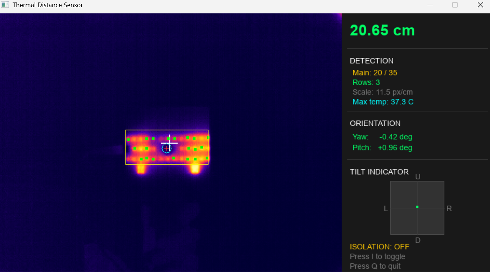

# PCB Grid Thermal Distance Sensor

A thermal imaging system for measuring distance and orientation to glass surfaces using a custom heat emitter grid and computer vision algorithms.


## Overview

This system measures distance to glass surfaces by detecting the thermal reflection of a known emitter pattern. Glass is opaque to longwave infrared radiation, causing the heat signature to be reflected. By analyzing the apparent size and position of the reflected pattern, the system calculates distance and camera orientation in real-time.



### Key Features

- **Real-time distance measurement** using blob-based scale estimation
- **Camera orientation tracking** (yaw and pitch angles) from reflection position
- **Temporal persistence** - maintains tracking through brief detection dropouts
- **Adaptive filtering** with velocity-aware smoothing for stable, responsive readings
- **Scaled hot spot detection** - works reliably from close range to far distances
- **Visual UI** with thermal image display, detection overlays, and measurement sidebar

## How It Works

### Physical Principle

Glass is opaque to longwave infrared (LWIR) radiation, so thermal cameras see glass as a mirror. A PCB with a grid of heat emitters is mounted around the camera. When pointed at glass, the emitters' reflections appear as a pattern of hot spots.

```
                         GLASS SURFACE
                              │
    ┌─────────────────────┐   │   ┌─────────────────────┐
    │ ● ● ● ● ● ● ● ● ● ● │   │   │ ● ● ● ● ● ● ● ● ● ● │
    │ ● ● ● ●     ● ● ● ● │   │   │ ● ● ● ●     ● ● ● ● │
    │ ● ● ● ● ● ● ● ● ● ● │◄──┼──►│ ● ● ● ● ● ● ● ● ● ● │
    │     ◆           ◆   │   │   │     ◆           ◆   │
    └─────────────────────┘   │   └─────────────────────┘
           PCB                │         Reflection
        (with camera          │      (seen by camera)
         in center)           │
```

### PCB Layout

The custom PCB features a 45-emitter grid pattern:

| Component | Specification |
|-----------|---------------|
| Main Grid | 3 rows × 13 columns (35 emitters) |
| Camera Hole | Center of row 1, columns 5-7 missing |
| Anchor Points | 2 diamond patterns (5 emitters each) below main grid |
| Horizontal Spacing | 0.8 cm between emitters |
| Vertical Spacing | 1.2 cm between rows |
| Total Grid Size | 9.6 cm × 2.4 cm |

### Distance Calculation

Distance is derived from the apparent size of the reflected grid:

```
scale = blob_width_px / visible_grid_width_cm
optical_distance = focal_length_px / scale
glass_distance = optical_distance / 2 × calibration_factor
```

The division by 2 accounts for the reflection geometry (light travels camera → glass → PCB reflection → glass → camera).

### Angle Calculation

Camera orientation is determined by the position of the camera hole (grid center) relative to the image center:

```
yaw = (hole_x - image_center_x) / (image_width / 2) × (HFOV / 2)
pitch = (hole_y - image_center_y) / (image_height / 2) × (VFOV / 2)
```

## Hardware Requirements

| Component | Specification |
|-----------|---------------|
| Thermal Camera | Seek Thermal SD314SPX Drone Core |
| Resolution | 320 × 240 pixels |
| Field of View | 56° horizontal, ~44° vertical |
| PCB Emitter Grid | Custom 45-emitter pattern (see PCB Layout) |
| Emitter Spacing | 0.8 cm horizontal, 1.2 cm vertical |

## Software Dependencies

| Dependency | Purpose |
|------------|---------|
| Seek Thermal SDK | Camera interface and frame capture |
| SDL2 | Window management and rendering |
| SDL2_ttf | Font rendering for UI |
| C++11 or later | Language standard |

## Building

### Linux

```bash
mkdir build && cd build
cmake ..
make
```

### Windows (with vcpkg)

```bash
mkdir build && cd build
cmake .. -DCMAKE_TOOLCHAIN_FILE=[vcpkg root]/scripts/buildsystems/vcpkg.cmake
cmake --build . --config Release
```

### Build Options

| Option | Default | Description |
|--------|---------|-------------|
| `SEEKCAMERA_INCLUDE_DIR` | `/usr/include` | Seek SDK include path |
| `SEEKCAMERA_LIB_DIR` | `/usr/lib` | Seek SDK library path |

## Usage

### Running

```bash
./thermal_distance_sensor
```

### Controls

| Key | Action |
|-----|--------|
| `I` | Toggle isolation mode (highlight hot regions only) |
| `Q` | Quit application |

### Display Elements

| Element | Description |
|---------|-------------|
| Thermal Image | Color-mapped temperature display with sharpening |
| Yellow Box | Detected PCB bounding box |
| Cyan Circle | Camera hole detection |
| Red Crosshair | Grid center / camera pointing direction |
| Green Dots | Matched emitter positions |
| White Crosshair | Image center reference |

### Sidebar Information

- **Distance** - Measured distance to glass in centimeters
- **Detection Stats** - Matched dots, rows detected, scale factor
- **Orientation** - Yaw and pitch angles in degrees
- **Tilt Indicator** - Visual representation of camera orientation
- **Mode Status** - Current isolation mode state

## Algorithm Details

### Blob Detection with Flood-Fill

The system uses flood-fill from the hottest pixel to identify connected thermal regions:

```cpp
threshold = min_temp + (max_temp - min_temp) × 0.25
// Flood-fill from peak, expanding to adjacent pixels above threshold
// Track weighted centroid and bounding box during fill
```

### Validation Criteria

Detected blobs must pass multiple checks to be considered valid PCB detections:

| Check | Requirement | Purpose |
|-------|-------------|---------|
| Minimum Size | ≥15×6 pixels | Reject noise |
| Temperature Range | ≥3°C above ambient | Ensure active heat source |
| Peak Count | ≥3 local maxima | Verify grid pattern (not single heat source) |
| Cold Interior | ≥2°C below max in center | Confirm camera hole presence |

### Temporal Persistence

The system maintains detection through brief dropouts:

```cpp
// On successful detection:
frames_since_detection = 0
confidence = 1.0

// On failed detection:
frames_since_detection++
confidence *= 0.85  // Decay 15% per frame

// Return last known state if within holdover window (10 frames)
if (frames_since_detection <= 10 && confidence > 0.1)
    return last_valid_result
```

### Adaptive Smoothing

Filter responsiveness adapts to motion:

```cpp
// Velocity tracking with asymmetric response
if (instant_velocity > velocity)
    velocity = 0.4 × instant + 0.6 × velocity  // Fast rise
else
    velocity = 0.02 × instant + 0.98 × velocity  // Slow decay

// Smoothing alpha based on velocity
alpha = 0.05 (stationary) → 0.4 (fast motion)
```

## Performance

| Metric | Value |
|--------|-------|
| Frame Rate | ~27 Hz (camera limited) |
| Detection Latency | <100 ms typical |
| Distance Range | 5-100+ cm |
| Angular Range | ±28° yaw, ±22° pitch |
| Distance Accuracy | ±2 cm typical (after calibration) |

## API Reference

### Core Classes

```cpp
namespace thermal {
    class PCBGridSensor {
        GridResult detect(float* temps, int width, int height);
        std::vector<HotSpot> findHotSpots(float* temps, int w, int h, 
                                          float threshold, float scale);
    };
}
```

## License

MIT License - See LICENSE file for details.

## Acknowledgments

- Seek Thermal for the camera SDK and hardware
- SDL2 development team for the multimedia library
- Prox SG for resources and platforms